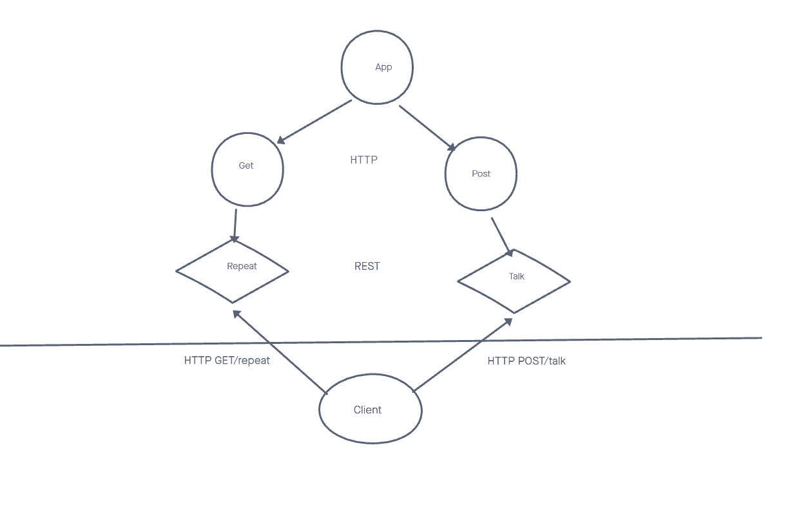

# server-deployment-pratice
lab01

Express Server
Created by instructor Jacob
Copied by
Kyle Cohen

# Links to App Deploy
- [Heroku Prod](https://dashboard.heroku.com/apps/kylecohen-server-deploy-prod)
- [Heroku Dev](https://dashboard.heroku.com/apps/kylecohen-server-deploy-dev)
- [Actions](https://github.com/kylecohen14/server-deployment-pratice/actions)
- [PR](https://github.com/kylecohen14/server-deployment-pratice/pulls?q=is%3Apr+is%3Aopen+sort%3Aupdated-desc)

Routes
HTTP GET

Path: /repeat
responds with the last string used in post route /talk.
HTTP POST

Path: /talk
Accepts a string.
responds with a string in all caps.